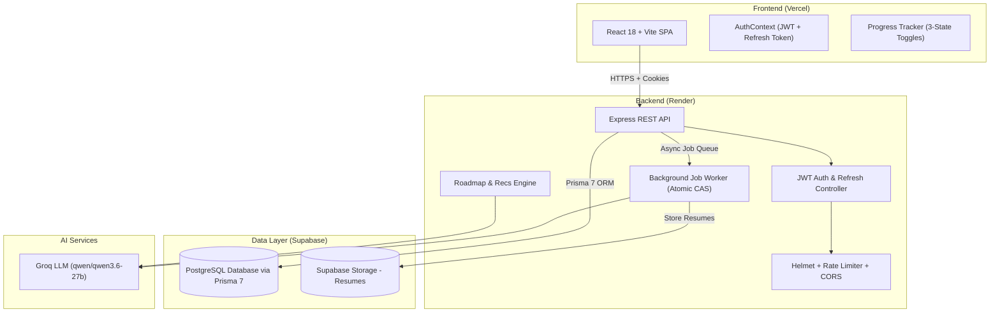

# 🚀 SkillForge AI — AI-Powered Career Mentor & Roadmap Generator

[](https://skill-forge-ai-rose.vercel.app/)
[](https://vitejs.dev/)
[](https://expressjs.com/)
[](https://supabase.com/)
[](https://www.prisma.io/)
[](https://groq.com/)

> **🌐 Live Frontend:** [https://skill-forge-ai-rose.vercel.app/](https://skill-forge-ai-rose.vercel.app/)  
> **⚡ Live Backend API:** [https://skillforge-ai-fwep.onrender.com/api/v1](https://skillforge-ai-fwep.onrender.com/api/v1)

SkillForge AI is a student-first, production-grade career intelligence platform that transforms resumes into clear, actionable, personalized learning roadmaps. It extracts technical skills, benchmarks candidates against target industry roles, generates curated 3-phase milestone roadmaps, and provides interactive progress tracking.

---

## ✨ Key Capabilities & Features

### 📄 1. Intelligent Resume Parsing & Extraction
- **PDF & DOCX Support**: Extract skills from multi-page PDFs (`pdf-parse`) and DOCX documents (`mammoth` + raw buffer fallback).
- **Special-Character Skill Matching**: Accurate lookahead/lookbehind regex matching for skills containing punctuation like `C++`, `C#`, `.NET`, `Node.js`, `UI/UX`, `CI/CD`.
- **Zero-Disk-Dependency Worker**: File buffer embedded in PostgreSQL job payload for 100% cloud reliability on Render.
- **Resume Re-Upload**: Update resume anytime from navbar or dashboard; skills are automatically upserted without duplication.
- **Direct Skill Entry**: Permanent "Skip & Enter Skills Manually" link for users who don't have a resume file on hand.

### 🎯 2. Career Grounding & Gap Benchmark
- **20+ Curated Roles**: Full Stack, Frontend, Backend, AI/ML Engineer, DevOps, Android, Product Manager, Cloud Architect, UI/UX, etc.
- **Skill Gap Matrix**: Categorizes user skills into **Matched**, **Level Gaps** (*Beginner → Advanced*), and **Missing Skills**.
- **Normalization Engine**: Auto-aliases skills (`js → javascript`, `mongo → mongodb`, `k8s → kubernetes`, `postgres → postgresql`).

### 🗺️ 3. Dynamic 3-Phase Roadmap Generation
- **Phase 1**: *Foundation & Gap Remediation*
- **Phase 2**: *Intermediate Implementation & Feature Architecture*
- **Phase 3**: *Production Delivery, Performance & Deployment*
- **Curated Learning Links**: Direct links to official docs, MDN, and freeCodeCamp for every focus topic.
- **Capstone Project Ideas**: Hands-on project recommendations with difficulty levels and estimated hours.
- **Industry Certifications**: Verified industry certifications (*AWS, Azure, Docker, Kubernetes, GCP*) with direct links and cost badges.

### 📈 4. Server-Synced Progress Tracking
- **Interactive 3-State Toggle**: Cycle between ⚪ *Not Started* → ⏳ *In Progress* → ✅ *Completed* for every milestone topic.
- **Live Summary Cards**: Server-computed task progress (`GET /api/v1/progress/summary`), completion percentage, and active tasks count.
- **Collapsible Phases**: Clean accordion interface for distraction-free, focused study.

### 🔐 5. Security, Long Sessions & Privacy
- **Long-Lived Refresh Tokens**: 7-day refresh token in HTTP-only cookie with silent 401 interception and recovery.
- **Account Deletion & Data Privacy**: `DELETE /api/v1/auth/account` with bcrypt password verification, cascading PostgreSQL deletion, and Supabase Storage bucket cleanup.
- **Robustness**: Rate limiting, strict CORS allowlist with wildcard `*.vercel.app` support, and 60-second stalled job recovery worker sweep.

---

## 🏗️ Architecture Overview



---

## 📁 Directory Structure

```
SkillForge AI/
├── backend/
│   ├── prisma/
│   │   ├── schema.prisma        # Prisma ORM Models (User, Resume, Skill, Job, Progress, Roadmap)
│   │   └── seedRoles.js         # Curated 20+ Career Role Seeder
│   ├── src/
│   │   ├── config/              # Environment, Database, Supabase Storage
│   │   ├── controllers/         # Auth, Resume, Job, Progress Controllers
│   │   ├── middleware/          # Auth, Security, Rate Limiter, File Validator
│   │   ├── routes/              # Auth, Resume, Skills, Roles, Roadmap, Progress
│   │   ├── services/            # Extractor, Parser, Worker, Roadmap Generator
│   │   ├── utils/               # JWT Token & Cookie Helpers
│   │   ├── app.js               # Express Application
│   │   └── server.js            # Server Entry & Background Worker
│   └── package.json
│
└── frontend/
    ├── src/
    │   ├── components/          # Layout, Navigation, ProtectedRoute
    │   ├── context/             # AuthContext Provider
    │   ├── hooks/               # useAuth, useOnboardingStatus
    │   ├── pages/
    │   │   ├── Landing/         # Public Hero & Feature Highlights
    │   │   ├── Login/           # Login & Password Recovery
    │   │   ├── Register/        # 6-Digit Email OTP Registration
    │   │   ├── Upload/          # Resume Drag-and-Drop & Manual Skip
    │   │   ├── SkillsConfirm/   # Skills Confirmation & Manual Entry
    │   │   ├── RoleSelection/   # Target Role Selector
    │   │   └── Dashboard/       # Progress Dashboard & Roadmaps
    │   ├── services/            # API Fetch Client with Silent Token Refresh
    │   ├── App.jsx              # React Router Navigation
    │   └── main.jsx
    └── package.json
```

---

## 🗃️ Database Models (Prisma 7)

| Model | Table | Purpose |
|---|---|---|
| `User` | `users` | User credentials, email, target role reference |
| `Resume` | `resumes` | Uploaded resume metadata, storage keys, parsed status |
| `Skill` | `skills` | User technical skills (`source: extracted/manual`, proficiency) |
| `Job` | `jobs` | Background parsing queue with atomic CAS status |
| `Progress` | `progress` | Per-topic learning status (`not_started`, `in_progress`, `completed`) |
| `Roadmap` | `roadmaps` | Benchmarks, 3-phase milestones, projects, and certifications |
| `RoleReference` | `roles_reference` | Curated grounding dataset of 20+ career paths |

---

## 💻 Local Development Setup

### 1. Prerequisites
- Node.js v18+
- PostgreSQL database (or Supabase connection string)

### 2. Backend Setup
```bash
cd backend
npm install
cp .env.example .env

# Run database push and seed grounding roles
npx prisma db push
node prisma/seedRoles.js

# Start backend development server
npm run dev
```

### 3. Frontend Setup
```bash
cd frontend
npm install

# Start Vite development server
npm run dev
```

Visit `http://localhost:5173` in your browser.

---

## 🧪 Running Tests

```bash
cd backend
npm test
```
Runs 18 unit tests across skill extractors, boundary regex matchers, and token validators using Jest.

---

## 📜 License

This project is licensed under the [MIT License](LICENSE).
